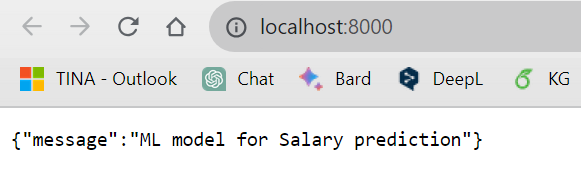
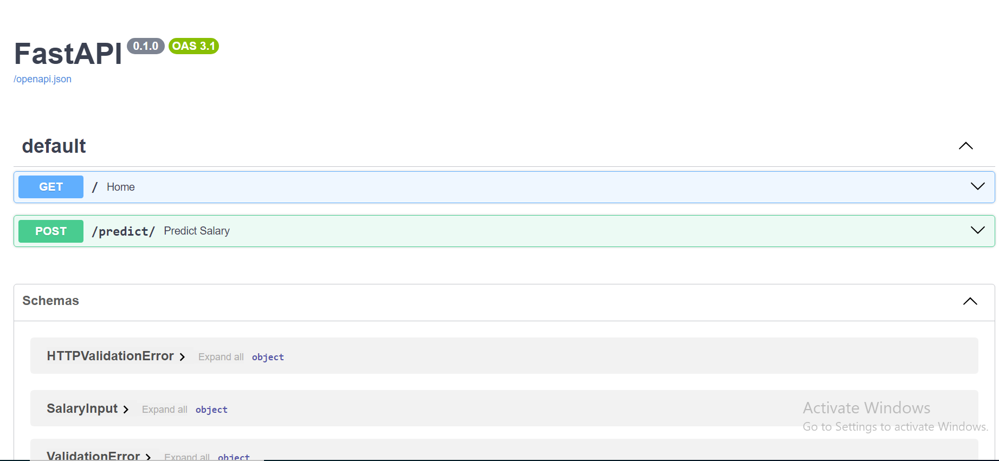
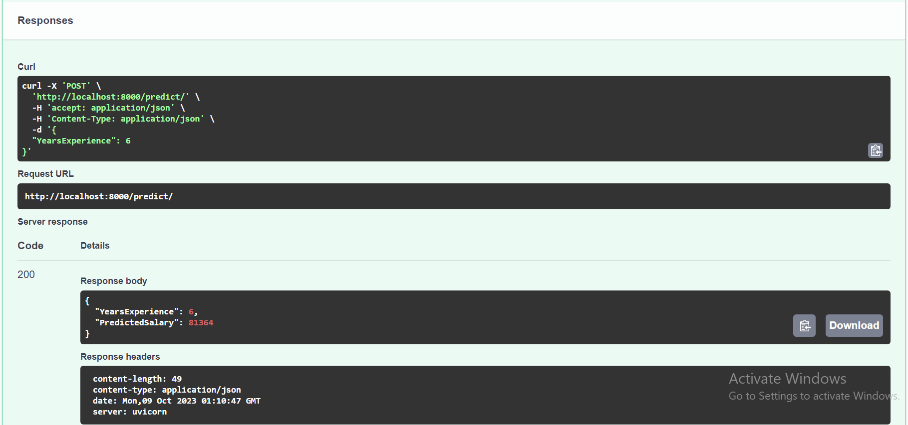

# Salary-prediction-fastapi-api

*Capture d'écran de la page d'accueil de l'API.*

*Capture d'écran de la documentation de l'API.*

*Capture d'écran de l'API testée.*

## Description
This is a simple FastAPI-based API that predicts salary based on years of experience using a linear regression model.

## Features
- Salary prediction based on years of experience.
- User-friendly interface.

## Usage
1. Clone this repository: `git clone https://github.com/your-username/salary-prediction-api.git`
2. Navigate to the project directory: `cd salary-prediction-api`
3. Create a virtual environment: `python -m venv venv`
4. Activate the virtual environment:
   - On Windows: `venv\Scripts\activate`
   - On macOS and Linux: `source venv/bin/activate`
5. Install dependencies: `pip install -r requirements.txt`
6. Run the API: `uvicorn main:app --host 0.0.0.0 --port 8080 --reload`
7. Open your web browser and access the following URL: `http://localhost:8080/docs`

## Prerequisites
- Python 3.x
- A modern web browser

## Author
TINA Djara Olivier
